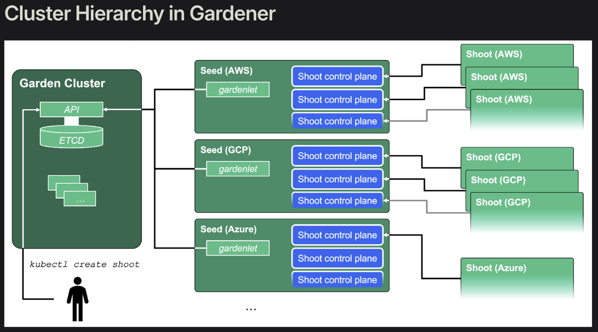
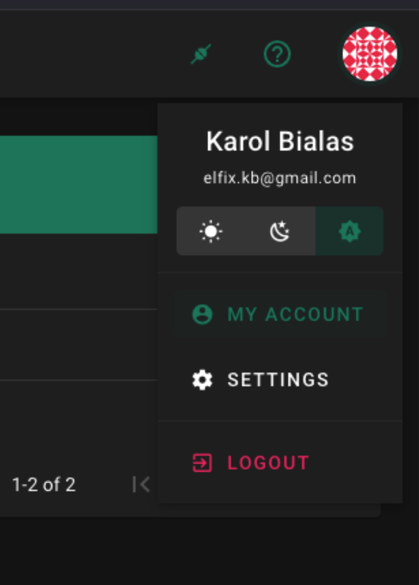
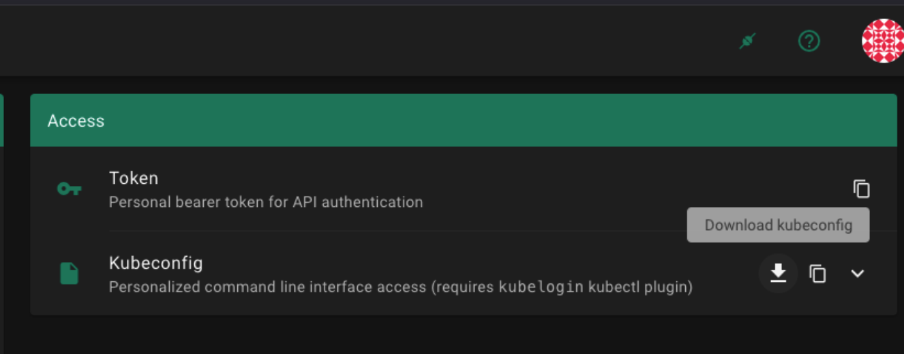
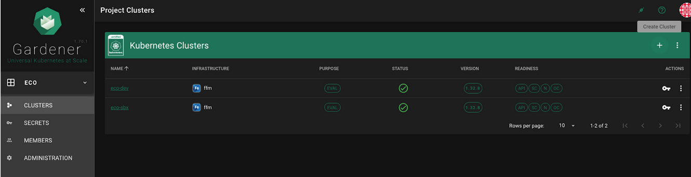
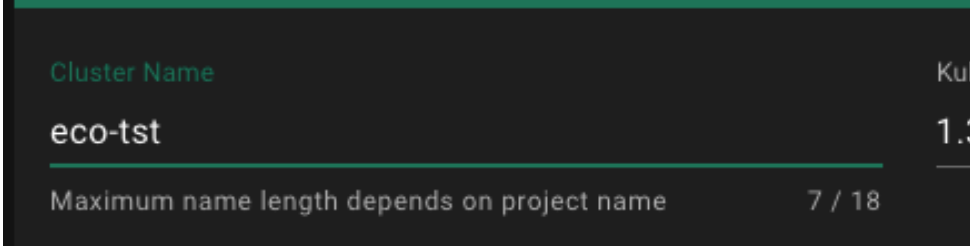
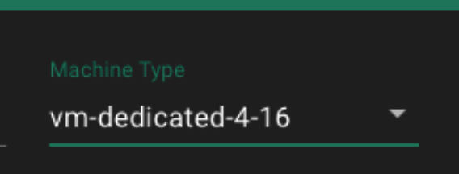
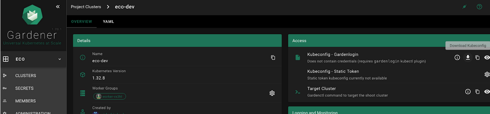
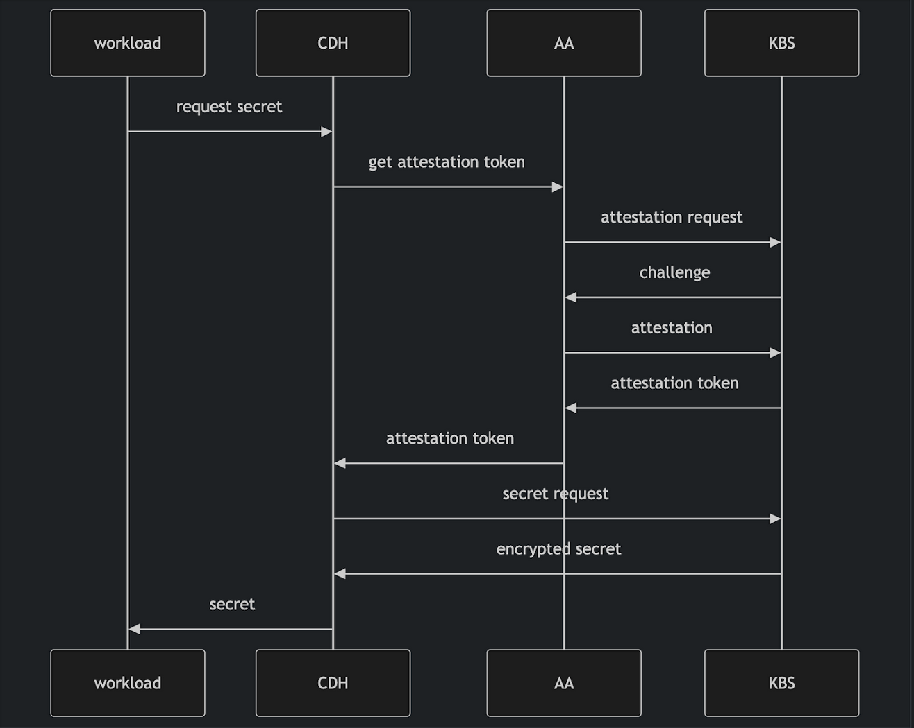

# Overview of Gardener Kubernetes on T-Systems OSC and Confidential Computers.
## Introduction

This document provides a practical guide to setting up Kubernetes clusters with Gardener on the Open Sovereign Cloud (OSC) by T-Systems, and evaluates how Confidential Containers (CoCo) can be introduced on top of such environments. It is intended for platform engineers, DevOps teams, and architects who need both a reproducible way to provision and access Gardener Shoot clusters, as well as a clear understanding of the requirements, design concepts, and runtime implications of Confidential Containers in a sovereign-cloud context.
The first part of the document walks through the end-to-end Gardener setup on Open Sovereign Cloud: installing gardenlogin and kubelogin, configuring access to the Garden cluster, creating and connecting to Shoot clusters, and exposing workloads via an ingress controller and static IPs. This section is focused on enabling a stable, repeatable cluster foundation within the T-Systems sovereign infrastructure that can be used for development, testing, or production workloads.
The second part provides an analysis of Confidential Containers, including their architecture, pod-centric design, impact on the Trusted Computing Base (TCB), and the role of Kata Containers, image handling, and attestation flows. It outlines hardware and Kubernetes prerequisites, supported platforms, deployment steps using the CoCo operator, and the available runtime classes for different confidential computing backends. Together, these two perspectives - cluster provisioning with Gardener on Open Sovereign Cloud T-Systems and workload protection with Confidential Containers - offer a cohesive foundation for building secure, sovereign, and confidential cloud-native environments.

## Gardener Setup

### Introduction to Gardener

Gardener architecture is based on the Kubeception concept (name derived from ‘Inception’ movie) where Kubernetes is in Kubernetes which is in another Kubernetes. So we have 3 Kubernetes layers:[^1]
- **Garden** cluster - top layer cluster that contains seed clusters inside
- **Seed** cluster (usually one seed is dedicated for each Kubernetes provider, like AWS, GCP, Azure etc)
- **Shoot** cluster - actual cluster to be used, embedded inside seed cluster

### Connect to Shoot Cluster
#### Summary of steps

1. Install Gardenlogin
2. Install Kubelogin
3. Obtain kubeconfig for Garden cluster
4. Configure Gardenlogin
5. Create cluster (optional, as 2 clusters have been created)
6. Get kubeconfig for Gardener Shoot cluster
7. Connect to Gardener Shoot cluster

#### Sample Files
* **gardenctl-v2.yaml** - Garden config file with collection of gardens
* **kubeconfig-garden-eco.yaml** - Garden kubeconfig
* **kubeconfig-gardenlogin--eco--eco-sbx.yaml** - Shoot cluster kubeconfig for eco-sbx cluster
* **kubeconfig-gardenlogin--eco--eco-dev.yaml** - Shoot cluster kubeconfig for eco-dev cluster

All files are recommended to be stored in folder $HOME/.garden

#### Install Gardenlogin

Reference document: https://github.com/gardener/gardenlogin#installation

It’s recommended to install Gardenlogin from GitHub Release using instructions:

    # set operating system and architecture
    os=darwin # choose between darwin, linux, windows
    arch=amd64
    
    # Get latest version. Alternatively set your desired version
    version=$(curl -s https://raw.githubusercontent.com/gardener/gardenlogin/master/LATEST)
    
    # Download gardenlogin
    curl -LO "https://github.com/gardener/gardenlogin/releases/download/${version}/gardenlogin_${os}_${arch}"
    
    # Make the gardenlogin binary executable
    chmod +x "./gardenlogin_${os}_${arch}"
    
    # Move the binary in to your PATH
    sudo mv "./gardenlogin_${os}_${arch}" /usr/local/bin/gardenlogin
    
    # create kubectl-gardenlogin symlink
    sudo ln -s /usr/local/bin/gardenlogin /usr/local/bin/kubectl-gardenlogin

#### Install Kubelogin
Reference document: https://github.com/int128/kubelogin
Install the latest release from Homebrew, Krew, Chocolatey or GitHub Releases.

    # Homebrew (macOS and Linux)
    brew install kubelogin
    
    # Krew (macOS, Linux, Windows and ARM)
    kubectl krew install oidc-login
    
    # Chocolatey (Windows)
    choco install kubelogin

#### Obtain kubeconfig for Garden cluster

Download **kubeconfig for garden cluster** from Gardener Dashboard (https://gardener.apps.fg1.ffm.osc.live) :
* Click on User Icon (Screenshot #1)
* My Account (Screenshot #1)
* Access TAB (Screenshot #2)
* Kubeconfig section (Screenshot #2)
* Download icon (Screenshot #2)

Save it to file (recommended path **$HOME/.garden/kubeconfig-garden-eco.yaml**)

Screenshot #1 Go to My Account menu

Screenshot #2 Download kubeconfig for Garden cluster

#### Configure Gardenlogin
Reference document: https://github.com/gardener/gardenlogin#configure-gardenlogin

Configure path to the downloaded garden cluster kubeconfig file (kubeconfig for garden cluster) in file **$HOME/.garden/gardenctl-v2.yaml** according to the pattern:

      gardens:
        - identity: fg1
          kubeconfig: "<path-to-garden-cluster-kubeconfig>"

The following is a sample configuration for gardenlogin as well as gardenctl and previously downloaded file.

    gardens:
    - identity: fg1
      kubeconfig: $HOME/.garden/kubeconfig-garden-eco.yaml

Where $HOME should be literally given.

Alternatively, you can run the following gardenctl command:

    gardenctl config set-garden fg1 --kubeconfig "<path-to-garden-cluster-kubeconfig>"

#### Create cluster

* Go to Gardener Dashboard https://gardener.apps.fg1.ffm.osc.live
* Select ‘Clusters’ menu (Screenshot #3)
* Click icon with “+” button (Screenshot #3)
* Define ‘Cluster name’ (i.e. eco-tst) (Screenshot #4)
* Define ‘Machine Type’ (i.e. vm-dedicated-4-16) (Screenshot #5)
* Click ‘Create’ button

Screenshot #3 Trigger ‘add cluster’ action

Screenshot #4 Define cluster name

Screenshot #5 Define Machine Type

#### Summary of available machine types

| Name                      | CPU | GPU  | Memory | Storage Class | Storage Size | Architecture |
|:--------------------------|:---:|:----:|-------:|:-------------:|-------------:|-------------:|
| vm-dedicated-2-4          |  2  |  0   |    4Gi |     fast      |         40Gi |        amd64 |
| vm-dedicated-2-8          |  2  |  0   |    8Gi |     fast      |         40Gi |        amd64 |
| vm-dedicated-2-16         |  2  |  0   |   16Gi |     fast      |         40Gi |        amd64 |
| vm-dedicated-4-8          |  4  |  0   |    8Gi |     fast      |         40Gi |        amd64 |
| vm-dedicated-4-16         |  4  |  0   |   16Gi |     fast      |         40Gi |        amd64 |
| vm-dedicated-8-8          |  8  |  0   |    8Gi |     fast      |         40Gi |        amd64 |
| vm-dedicated-8-16         |  8  |  0   |   16Gi |     fast      |         40Gi |        amd64 |
| vm-dedicated-8-64         |  8  |  0   |   64Gi |     fast      |         40Gi |        amd64 |
| vm-dedicated-16-32        | 16  |  0   |   32Gi |     fast      |         40Gi |        amd64 |
| vm-dedicated-16-64        | 16  |  0   |   64Gi |     fast      |         40Gi |        amd64 |
| vm-dedicated-16-128       | 16  |  0   |  128Gi |     fast      |         40Gi |        amd64 |
| vm-dedicated-16-236       | 16  |  0   |  236Gi |     fast      |         40Gi |        amd64 |
| vm-dedicated-32-64        | 32  |  0   |   64Gi |     fast      |         40Gi |        amd64 |
| vm-dedicated-sgx-2-4-4    |  2  |  0   |    4Gi |     fast      |         40Gi |        amd64 |
| vm-dedicated-sgx-4-4-64   |  4  |  0   |    4Gi |     fast      |         40Gi |        amd64 |
| vm-dedicated-sgx-4-16-16  |  4  |  0   |   16Gi |     fast      |         40Gi |        amd64 |
| vm-dedicated-sgx-8-8-8    |  8  |  0   |    8Gi |     fast      |         40Gi |        amd64 |
| vm-dedicated-sgx-8-16-16  |  8  |  0   |   16Gi |     fast      |         40Gi |        amd64 |
| vm-dedicated-sgx-8-32-32  |  8  |  0   |   32Gi |     fast      |         40Gi |        amd64 |
| vm-dedicated-sgx-8-32-60  |  8  |  0   |   32Gi |     fast      |         40Gi |        amd64 |
| vm-dedicated-sgx-8-32-64  |  8  |  0   |   32Gi |     fast      |         40Gi |        amd64 |
| vm-dedicated-sgx-16-32-32 | 16  |  0   |   32Gi |     fast      |         40Gi |        amd64 |
| vm-dedicated-sgx-16-32-4  | 16  |  0   |   64Gi |     fast      |         40Gi |        amd64 |
| vm-dedicated-sgx-16-64-64 | 16  |  0   |   64Gi |     fast      |         40Gi |        amd64 |
| vm-dedicated-sgx-32-32-32 | 32  |  0   |   32Gi |     fast      |         40Gi |        amd64 |
| vm-dedicated-sgx-32-32-60 | 32  |  0   |   32Gi |     fast      |         40Gi |        amd64 |

#### Get kubeconfig for Gardener Shoot cluster

* Go to Gardener Dashboard
* Select 'Clusters' in Menu
* click on given cluster (i.e. eco-sbx)
* TAB 'Access' (Screenshot #6)
* Section 'Kubeconfig - Gardenlogin'  (Screenshot #6)
* Click Download Icon  (Screenshot #6)

So far 2 clusters have been created and 2 kubeconfig files are available for download:
- **eco-sbx** cluster
  - vm-dedicated-2-4 - 2 CPU cores, 4GB RAM
  - file ~/.garden/kubeconfig-gardenlogin--eco--eco-sbx.yaml
- **eco-dev** cluster
  - vm-dedicated-16-128 - 16 CPU cores, 128GB RAM
  - file ~/.garden/kubeconfig-gardenlogin--eco--eco-dev.yaml

Screenshot #6 Button for ‘Kubeconfig download’ for a shoot cluster

#### Connect to Gardener Shoot cluster

In order to connect, just like for any other cluster KUBECONFIG variable must be pointed to the downloaded shoot cluster file:

    export KUBECONFIG=$HOME/.garden/kubeconfig-shoot-cluster-example.yaml

For example:

    # eco-sbx cluster
    export KUBECONFIG=$HOME/.garden/kubeconfig-gardenlogin--eco--eco-sbx.yaml
    # eco-dev cluster
    export KUBECONFIG=$HOME/.garden/kubeconfig-gardenlogin--eco--eco-dev.yaml

### Ingress Controller

In order to access the cluster via static IP or configure the domains and subdomains for services, Ingress Controller needs to be installed.

For the clusters that have been setup ingress-nginx controller has been installed using the following commands:

    kubectl create namespace ingress-nginx
    helm repo add ingress-nginx https://kubernetes.github.io/ingress-nginx
    helm install ingress-nginx ingress-nginx/ingress-nginx --namespace ingress-nginx --set controller.publishService.enabled=true

#### Static IPs
As a result the clusters have received the following static IPs:
* eco-sbx cluster: **160.44.12.35**
* eco-dev cluster: **160.44.12.115**

#### Demo Service and Ingress

In order to demonstrate successful operation of static IP address and ingress controller, sample resources have been created:
* namespace ‘demo’
* deployment ‘web’
* service ‘web’
* ingress ‘demo-ip-ingress’

The resources have been put into single file demo.yaml and applied using command:

    kubectl apply -f demo.yaml

Afterwards, the demo endpoint is reachable using commands:

    #eco-sbx    
    curl http://160.44.12.35/demo
    # eco-dev
    curl http://160.44.12.115/demo

Here is the definition of the resources: [demo.yaml](yaml/demo.yaml)

## Confidential Containers Analysis

### Introduction
The purpose of this Document is the Analysis of requirements and installation procedure for Confidential Containers.

#### Design overview

Confidential computing projects are largely defined by what is inside the enclave and what is not. For Confidential Containers, the enclave contains
* the workload pod
* helper processes
* daemons that facilitate the workload pod

Everything else, including
* the hypervisor
* other pods
* the control plane

is outside of the enclave and untrusted. This division is carefully considered to balance TCB size and sharing.

#### Container-centric vs node-centric approach
When trying to combine **confidential** computing and **cloud native** computing, often the first thing that comes to mind is either of the following options:
* **container-centeric** virtualization - put just one container inside of an enclave
  * can support very little sharing of resources
* **node-centric** virtualization - put an entire worker node inside of an enclave
  * tend to have a large TCB that includes components such as the Kubelet
  * this makes the attack surface of the confidential guest significantly larger
  * difficult to implement managed clusters because the workload runs in the same context as the rest of the cluster

Confidential Containers opts for a compromise between these approaches which avoids some of their pitfalls.[^2]
Characteristics of CoCo:
* pod-centric approach which balances TCB size and sharing
* have some daemons and processes inside the enclave
* the API of the guest is relatively small.
* the guest image is static and generic across workloads and even platforms, making it simpler to ensure security guarantees.
* sharing between containers in the same pod is easy. For example, the pod network namespace doesn’t leave the enclave, so containers can communicate confidentially on it without additional overhead. These are just a few of the reasons why pod-centric virtualization seems to be the best way to provide confidential cloud native computing.

#### TCB - Trusted Computing Base

For traditional Container TCB (non-confidential) usually includes:
* Host kernel
* Container runtime (containerd, CRI-O)
* Kubelet
* Entire host OS
* Node admin/root
* Attacker with host access

##### Trusted
In the case of Confidential Containers, the goal is to minimize the TCB in order to reduce the risk.
For that reason Confidential Containers reduce the TCB to the following components:
* TEE hardware/firmware (SEV-SNP, TDX, etc.)
* Kata Containers (Measured kernel + VM image)
* Attested guest image + workload
* Measured container image (if supported)
* Attestation service

##### Untrusted
The following elements are excluded from TCB (a.k.a. Untrusted):
* Host OS/kernel
* Container runtime (CRI-O/containerd)
* Kubernetes node components
* Cloud provider
* Hypervisor
* Node admin/root

#### Kata containers
Kata Containers is an open source community working to build a secure container runtime with lightweight VMs that feel and perform like containers, but provide stronger workload isolation using hardware virtualization technology as a second layer of defense.

Kata Containers are as light and fast as containers and integrate with the container management layers—including popular orchestration tools such as Docker and Kubernetes (k8s)—while also delivering the security advantages of VMs.[^3]

#### Image pulling
In case of **Kata Containers** container images are pulled **on the worker node** with the help of a CRI runtime like containerd. The images are exposed to the guest via filesystem passthrough. This is not suitable for confidential workloads because the container images are exposed to the untrusted host.
Therefore **Confidential Containers** images are pulled and unpacked **inside of the guest**.

#### Attestation
Attestation is a crucial part of confidential computing and a direct requirement of many guest operations.
For example, to unpack an encrypted container image, the guest must retrieve a secret key. Inside the guest the CDH (confidential-data-hub) and AA (attestation-agent) handle operations involving secrets and attestation. These components are beyond the scope of traditional Kata deployments and are located in the guest components repository.

Attestation process summary:

Where:
* **CDH** - Confidential Data Hub
* **AA** - Attestation Agent

### Requirements

* 8GB RAM
* 4 CPU cores on worker node
* Supported Hardware (either bare-metal or cloud one)
  * Own bare-metal platform
    * IBM s390x
    * AMD SEV-SNP - Secure Encrypted Virtualization-Secure Nested Paging
    * SGX
    * TDX
  * NVIDIA GPU - NVIDIA GPU Operator with Confidential Containers and Kata[^4]
  * Cloud platform
    * Azure AKS
    * Google Confidential GKE
    * AWS Confidential Computing
    * Alibaba Cloud
* Kubernetes cluster
  * version >1.24
  * using containerd or cri-o
  * at least one node has the label node.kubernetes.io/worker.
  * SELinux is not enabled.

#### Supported Platforms

##### IBM Secure Execution s390x[^5] 
systems:
* IBM z15 or newer models
* IBM LinuxONE III or newer models

Checks:

Protected Virtualization Support in the Kernel (expected: 1)

    cat /sys/firmware/uv/prot_virt_host
Ultravisor Memory Reservation

    sudo dmesg | grep -i ultravisor
Secure Execution Facility Bit

    cat /proc/cpuinfo | grep 158

More details can be found in the documentation. [^6]

##### AMD SEV-SNP [^7]
The host BIOS and kernel must be capable of supporting AMD SEV-SNP and the host must be configured accordingly.

The SEV Firmware version must be at least version 1.55 in order to have at least version 3 of the Attestation Report. The latest SEV Firmware version is available on AMD’s SEV Developer Webpage. It can also be updated via a platform OEM BIOS update.

The host kernel must be equal to or later than upstream version 6.16.1.

More details can be found in the documentation. [^8]

##### SGX
Not documented on CoCo page.[^9]

##### TDX [^10]

https://www.intel.com/content/www/us/en/developer/tools/trust-domain-extensions/overview.html

The process of preparation and installation described in the abovementioned resources is dependent on the OS. The following OS versions have been descrbied:
* CentOS Stream 9
* Ubuntu 24.04
* openSUSE Leap 15.5
* SUSE Linux Enterprise Server 15-SP5

The setup includes the following steps:
* Host OS Setup [^11]
  * Enable Intel TDX in the Host OS
  * Check Intel TDX enablement
  * Setup Quote Generation Service (QGS)
  * Configure QCNL
  * Setup Communication Path between QGS and TD
    * QEMU version
    * libvirt version
* Guest OS Setup
  * Prepare an Intel TDX-enabled Guest Image
  * Launch a Trust Domain

More details can be found in the documentation. [^12]

##### Cloud Hardware
Confidential Containers can be deployed via confidential computing cloud offerings. The main method of doing this is to use the cloud-api-adaptor also known as “peer pods.”[^13]

Some clouds also support starting confidential VMs inside of non-confidential VMs. With Confidential Containers these offerings can be used as if they were bare-metal.[^14]

#### Cluster Setup
Confidential Containers require Kubernetes. A cluster must be installed before running the operator. Many different clusters can be used but they should meet the following requirements.

1. The minimum Kubernetes version is 1.24
2. Cluster must use **containerd or cri-o**
3. At least one node has the label **node.kubernetes.io/worker**
4. SELinux is not enabled.

If you use Minikube or Kind to setup your cluster, you will only be able to use runtime classes based on Cloud Hypervisor due to an issue with QEMU.

#### Testing
For testing or development, Confidential Containers can be deployed without any hardware support (known as **coco-dev** or **non-tee**).
* functions the same way as Confidential Containers with an enclave,
* a non-confidential VM is used instead of a confidential VM
* does not provide any security guarantees

### Installation

#### Deploy the operator
Deploy the operator by running the following command where <RELEASE_VERSION> needs to be substituted with the desired release tag.[^15]

    kubectl apply -k github.com/confidential-containers/operator/config/release?ref=<RELEASE_VERSION>
For example, to deploy the v0.10.0 release run:

    kubectl apply -k github.com/confidential-containers/operator/config/release?ref=v0.10.0
Wait until each pod has the STATUS of Running.

    kubectl get pods -n confidential-containers-system --watch

Create the custom resource
Creating a custom resource installs the required CC runtime pieces into the cluster node and creates the runtime classes.

    # x86
    kubectl apply -k github.com/confidential-containers/operator/config/samples/ccruntime/default?ref=<RELEASE_VERSION>
    # s390x
    kubectl apply -k github.com/confidential-containers/operator/config/samples/ccruntime/s390x?ref=<RELEASE_VERSION>
    # SGX
    kubectl apply -k github.com/confidential-containers/operator/config/samples/enclave-cc/hw?ref=<RELEASE_VERSION>

Wait until each pod has the STATUS of Running.

    kubectl get pods -n confidential-containers-system --watch

##### Verify Installation
See if the expected runtime classes were created.

    kubectl get runtimeclass

The output varies depending on the platform
###### x86
    NAME           HANDLER        AGE
    kata                 kata-qemu            8d
    kata-clh             kata-clh             8d
    kata-qemu            kata-qemu            8d
    kata-qemu-coco-dev   kata-qemu-coco-dev   8d
    kata-qemu-sev        kata-qemu-sev        8d
    kata-qemu-snp        kata-qemu-snp        8d
    kata-qemu-tdx        kata-qemu-tdx        8d
###### s390x
    NAME           HANDLER        AGE
    kata           kata-qemu      60s
    kata-qemu      kata-qemu      61s
    kata-qemu-se   kata-qemu-se   61s
###### SGX
    NAME            HANDLER         AGE
    enclave-cc      enclave-cc      9m55s

##### Runtime Classes
CoCo supports many different runtime classes. Different deployment types install different sets of runtime classes. The operator may install some runtime classes that are not valid for your system. For example, if you run the operator on a TDX machine, you might have TDX and SEV runtime classes. Use the runtime classes that match your hardware.

| Name               | Type  | Description                                                          |
|:-------------------|:-----:|:---------------------------------------------------------------------|
| kata               |  x86  | Alias of the default runtime handler (usually the same as kata-qemu) |
| kata-clh           |  x86  | Kata Containers (non-confidential) using Cloud Hypervisor            |
| kata-qemu          |  x86  | Kata Containers (non-confidential) using QEMU                        |
| kata-qemu-coco-dev |  x86  | CoCo without an enclave (for testing only)                           |
| kata-qemu-sev      |  x86  | CoCo with QEMU for AMD SEV HW                                        |
| kata-qemu-snp      |  x86  | CoCo with QEMU for AMD SNP HW                                        |
| kata-qemu-tdx      |  x86  | CoCo with QEMU for Intel TDX HW                                      |
| kata-qemu-se       | s390x | CoCO with QEMU for Secure Execution                                  |
| enclave-cc         |  SGX  | CoCo with enclave-cc (process-based isolation without Kata)          |

#### Cloud platforms
Cloud platforms are an alternative option to CoCo installed on own Bare Metal machines for the projects where installation time needs to be saved and location on servers that belong to the company with headquarters outside of EU is not a problem.

During the research the following platforms have been identified:
* Azure AKS [^16]
  * currently offered as preview feature that is set to sunset in March 2026
  * starting on 30 November 2025, AKS  no longer supports or provides security updates for Azure Linux 2.0
  * easy to install [^17]
* Google Confidential GKE [^18]
  * supports technologies:
    * AMD Secure Encrypted Virtualization (SEV)
    * AMD Secure Encrypted Virtualization-Secure Nested Paging (SEV-SNP)
    * Intel Trust Domain Extensions (TDX)
  * installation is relatively simple [^19]
  * pricing is on the level on which CoCo is applied
    * Workload level
    * Cluster level
    * Node level
* AWS Confidential Computing [^20]
  * relatively easy to use [^21]
* Alibaba Cloud
  * easy to use [^22]
  * not recommended due to limited amount of experts in Alibaba Cloud area in the EU

#### NVIDIA GPU Operator

Reference document: 
https://docs.nvidia.com/datacenter/cloud-native/gpu-operator/23.6.1/gpu-operator-confidential-containers.html#about-support-for-confidential-containers

It must be noted that NVIDIA also offers CoCo technology on its GPU products. It’s recommended to take this into consideration when Bare Metal machine is considered and it is expected to be setup in cooperation with GPU processing which would also need to be secured in order to avoid security leaks where part of data is secured on CPU side without similar security on GPU side especially in case of heavy AI model training with lots of sensitive data being used for training.

#### Summary
The crucial decision that needs to be taken prior to the selection of CoCo technology and platform is decision whether to use out of the box Cloud solution (unfortunately there appears to be no product available by EU company) or invest time into own setup of Bare Metal machine with CPU that is compliant with CoCo.

In order to make it easier to have an overview of the information presented in this chapter the summary of the solutions has been compiled to the following table:

| Name                       |      Type      | Documentation complexity (1-5) | Installation complexity (1-3) | Readiness for production use  |
|:---------------------------|:--------------:|:------------------------------:|:-----------------------------:|:-----------------------------:|
| IBM Secure Execution s390x | Bare Metal CPU |               5                |               3               |              Yes              |
| AMD SEV-SNP                | Bare Metal CPU |               5                |               3               |              Yes              |
| Intel SGX                  | Bare Metal CPU |               5                |               3               |              Yes              |
| Intel TDX                  | Bare Metal CPU |               4                |               2               |              Yes              |
| NVIDIA GPU Operator        | Bare Metal GPU |               4                |               3               |              Yes              |
| Azure AKS                  |     Cloud      |               1                |               1               |              No               |
| Google Confidential GKE    |     Cloud      |               2                |               1               |              Yes              |
| AWS Confidential Computing |     Cloud      |               2                |               1               |              Yes              |

## Dictionary

* **TCB** (Trusted Computing Base) is a core concept in Confidential Containers (CoCo) and confidential computing in general. It defines all components that must be trusted to maintain the confidentiality and integrity of the workloads running inside a confidential VM or enclave.
* **CoCo** - Confidential Containers
* **enclave** -  a hardware-protected private region of memory (execution environment) that isolates code and data so that even privileged system software (host OS, hypervisor, cloud provider, or root user) cannot access or tamper with it.
* **TEE** - Trusted Execution Environment  is a secure area of a main processor. It helps the code and data loaded inside it be protected with respect to confidentiality and integrity. [^23]
* **SGX** - Software Guard Extensions [^24] - a set of instruction codes implementing TEE that are built into some Intel central processing units (CPUs). They allow user-level and operating system code to define protected private regions of memory, called enclaves. SGX is designed to be useful for implementing
  * secure remote computation
  * secure web browsing
  * digital rights management (DRM)
  * concealment of proprietary algorithms and of encryption keys [^25]
* **AA - Attestation Agent** - component inside the Confidential VM (CVM) that performs attestation, key request, and policy verification to ensure the workload is allowed to run securely
* **CVM** - Confidential VM
* **CDH - Confidential Data Hub** - component inside CVM that works closely with AA and provides the secure services and APIs used by workloads after attestation is successful.
* **Personas** - actors or agents - individuals or groups capable of carrying out a particular threat. Examples:
  * Infrastructure operator
  * Orchestration Operator
  * Workload Provider
  * Container Image Provider
* **CRI-O** is a lightweight, Kubernetes-native container runtime designed only for running containers in Kubernetes clusters. (good for RHEL, OKD, OpenShift)
* **CC Runtime (Confidential Containers Runtime)** is the secure, trusted execution runtime used in Confidential Containers (CoCo) to launch containers inside hardware-protected enclaves or Trusted Execution Environments (TEEs)
* **SEV-SNP - Secure Encrypted Virtualization-Secure Nested Paging** - one of CoCo technologies
* **TDX - Trust Domain Extensions** - one of CoCo technologies

## Sources

1. https://gardener.cloud/docs/getting-started/architecture/
2. https://confidentialcontainers.org/docs/architecture/design-overview/
3. https://katacontainers.io/learn/
4. https://docs.nvidia.com/datacenter/cloud-native/gpu-operator/23.6.1/gpu-operator-confidential-containers.html#about-support-for-confidential-containers
5. https://confidentialcontainers.org/docs/getting-started/prerequisites/hardware/se/
6. https://www.ibm.com/docs/en/hpvs/2.1.x?topic=servers-confidential-computing-linuxone
7. https://confidentialcontainers.org/docs/getting-started/prerequisites/hardware/snp/
8. https://www.amd.com/en/developer/sev.html
9. https://confidentialcontainers.org/docs/getting-started/prerequisites/hardware/sgx/
10. https://confidentialcontainers.org/docs/getting-started/prerequisites/hardware/tdx/
11. https://cc-enabling.trustedservices.intel.com/intel-tdx-enabling-guide/05/host_os_setup/
12. https://www.intel.com/content/www/us/en/developer/tools/trust-domain-extensions/overview.html
13. https://github.com/confidential-containers/cloud-api-adaptor
14. https://confidentialcontainers.org/docs/getting-started/prerequisites/cloud/
15. https://confidentialcontainers.org/docs/getting-started/installation/
16. https://learn.microsoft.com/en-us/azure/aks/confidential-containers-overview
17. https://confidentialcontainers.org/docs/examples/azure-simple/
18. https://docs.cloud.google.com/kubernetes-engine/docs/how-to/confidential-gke-nodes
19. https://confidentialcontainers.org/docs/examples/gcp-simple/
20. https://aws.amazon.com/confidential-computing/
21. https://confidentialcontainers.org/docs/examples/aws-simple/
22. https://confidentialcontainers.org/docs/examples/alibaba-cloud-simple/
23. https://en.wikipedia.org/wiki/Trusted_execution_environment
24. https://en.wikipedia.org/wiki/Software_Guard_Extensions
25. https://www.intel.com/content/www/us/en/developer/tools/software-guard-extensions/overview.html

[^1]: https://gardener.cloud/docs/getting-started/architecture/
[^2]: https://confidentialcontainers.org/docs/architecture/design-overview/
[^3]: https://katacontainers.io/learn/
[^4]: https://docs.nvidia.com/datacenter/cloud-native/gpu-operator/23.6.1/gpu-operator-confidential-containers.html#about-support-for-confidential-containers
[^5]: https://confidentialcontainers.org/docs/getting-started/prerequisites/hardware/se/
[^6]: https://www.ibm.com/docs/en/hpvs/2.1.x?topic=servers-confidential-computing-linuxone
[^7]: https://confidentialcontainers.org/docs/getting-started/prerequisites/hardware/snp/
[^8]: https://www.amd.com/en/developer/sev.html
[^9]: https://confidentialcontainers.org/docs/getting-started/prerequisites/hardware/sgx/
[^10]: https://confidentialcontainers.org/docs/getting-started/prerequisites/hardware/tdx/
[^11]: https://cc-enabling.trustedservices.intel.com/intel-tdx-enabling-guide/05/host_os_setup/
[^12]: https://www.intel.com/content/www/us/en/developer/tools/trust-domain-extensions/overview.html
[^13]: https://github.com/confidential-containers/cloud-api-adaptor
[^14]: https://confidentialcontainers.org/docs/getting-started/prerequisites/cloud/
[^15]: https://confidentialcontainers.org/docs/getting-started/installation/
[^16]: https://learn.microsoft.com/en-us/azure/aks/confidential-containers-overview
[^17]: https://confidentialcontainers.org/docs/examples/azure-simple/
[^18]: https://docs.cloud.google.com/kubernetes-engine/docs/how-to/confidential-gke-nodes
[^19]: https://confidentialcontainers.org/docs/examples/gcp-simple/
[^20]: https://aws.amazon.com/confidential-computing/
[^21]: https://confidentialcontainers.org/docs/examples/aws-simple/
[^22]: https://confidentialcontainers.org/docs/examples/alibaba-cloud-simple/
[^23]: https://en.wikipedia.org/wiki/Trusted_execution_environment
[^24]: https://en.wikipedia.org/wiki/Software_Guard_Extensions
[^25]: https://www.intel.com/content/www/us/en/developer/tools/software-guard-extensions/overview.html

